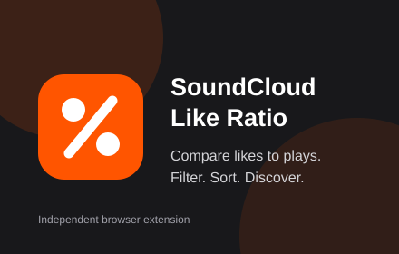
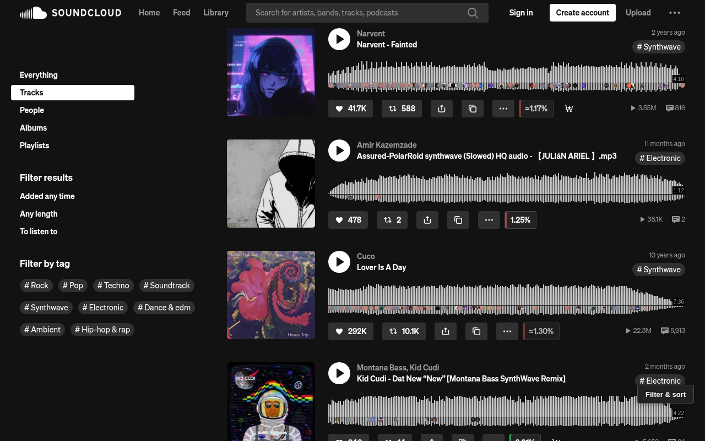
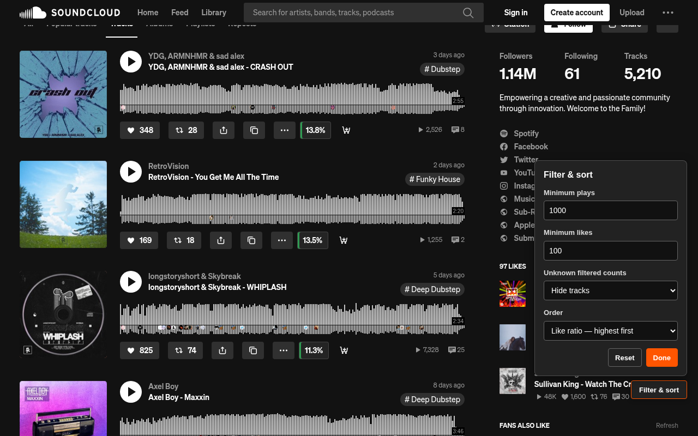
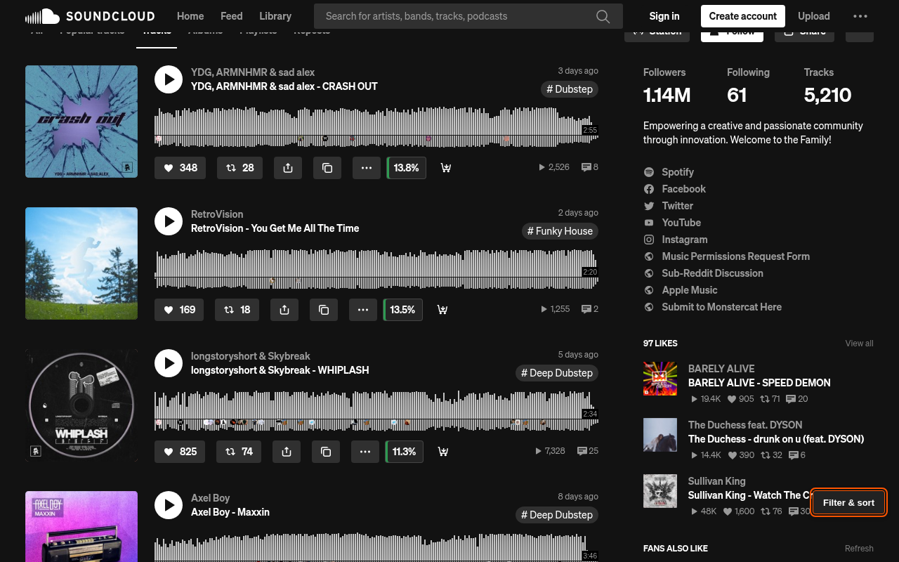

# SoundCloud Like Ratio

<p align="center">
  
</p>

<p align="center">
  <strong>See which SoundCloud tracks turn plays into likes.</strong>
</p>

<p align="center">
  <a href="https://github.com/TomoZG/soundcloud-like-ratio/actions/workflows/ci.yml"></a>
</p>

SoundCloud Like Ratio is a Chrome and Firefox extension that shows
the percentage of plays that resulted in a like. It can also filter loaded
tracks by minimum play or like counts and sort them by like percentage.

## Features

- Shows a likes-to-plays percentage beside supported SoundCloud tracks.
- Understands exact and abbreviated metrics such as `10.1K`.
- Updates as SoundCloud loads tracks or navigates between pages.
- Filters tracks by minimum play and like counts.
- Sorts loaded tracks by like percentage and restores their original order.
- Processes everything locally, without analytics or tracking.

## Screenshots

<p align="center">
  <a href="store-assets/screenshots/01-ratio-badges.png">
    
  </a>
</p>

<p align="center"><em>Exact and approximate ratios appear beside each supported Like button.</em></p>

<p align="center">
  <a href="store-assets/screenshots/02-filter-sort-panel.png">
    
  </a>
</p>

<p align="center"><em>Set minimum play and like counts, choose how unknown counts behave, and change the order.</em></p>

<p align="center">
  <a href="store-assets/screenshots/03-sorted-filtered-results.png">
    
  </a>
</p>

<p align="center"><em>Loaded tracks can be filtered and reordered from highest to lowest like ratio.</em></p>

> SoundCloud is a trademark of SoundCloud Global Limited & Co. KG. This project
> is not affiliated with or endorsed by SoundCloud.

## Install

Download and extract the `soundcloud-like-ratio-<version>.zip` asset from the
[latest release](https://github.com/TomoZG/soundcloud-like-ratio/releases/latest),
then follow the official instructions for
[Chrome](https://developer.chrome.com/docs/extensions/get-started/tutorial/hello-world#load-unpacked)
or [temporary installation in Firefox](https://extensionworkshop.com/documentation/develop/temporary-installation-in-firefox/).

## Filtering and sorting

A **Filter & sort** button appears in the bottom-right corner when a supported
track is present:

- **Minimum plays** and **Minimum likes** hide known counts below the threshold.
- **Unknown filtered counts** chooses whether tracks missing a count required by
  an active minimum remain visible. These tracks are hidden by default.
- **Order** switches between SoundCloud's original order and like percentage,
  highest first.
- **Reset** clears thresholds, restores hiding unknown filtered counts, and
  restores the original order.

An unreadable play count only matters when **Minimum plays** is set, and an
unreadable like count only matters when **Minimum likes** is set. Settings apply
to tracks loaded later by SoundCloud and survive in-page navigation, but reset
when the page or tab reloads.

Ratios calculated from exact counts are shown directly. When SoundCloud
provides an abbreviated metric, the extension marks the result as an estimate:
`≈3.63%` means approximately 3.63% of plays resulted in a like.

## Privacy

The extension reads visible like and play counts from SoundCloud and processes
them locally in the current browser tab. It has no analytics, advertising,
accounts, persistent storage, or extension-originated network requests.

## Development

Use Node.js 22 or newer:

```sh
npm install
npm run check
```

Useful commands:

- `npm test` runs calculation and DOM behavior tests.
- `npm run lint` validates JavaScript and the extension manifest.
- `npm run build` creates the minimal extension ZIP.
- `npm run verify:package` checks the ZIP against the runtime-file allow-list.
- `npm run start:chrome` or `npm run start:firefox` starts a temporary browser
  session.
- `scripts/render-assets.sh` recreates icons and the Chrome promotional tile
  from the version-controlled SVG sources.

The extension currently targets SoundCloud list and stream track markup. Since
that upstream markup is outside this project's control, selector changes should
include regression tests and manual checks in both browsers.

## License

MIT. See [LICENSE](LICENSE).
